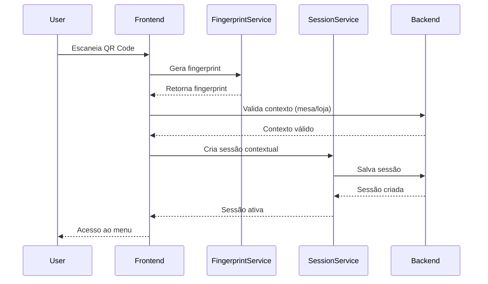
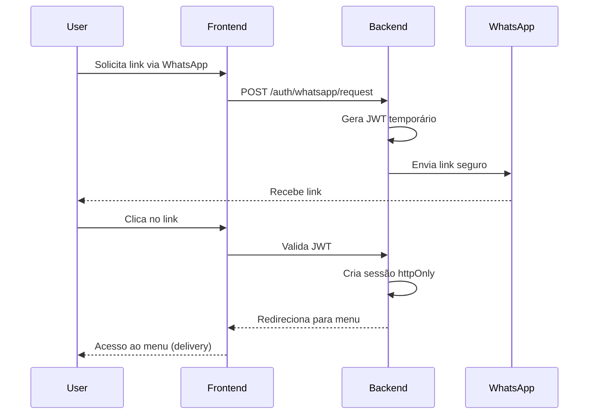
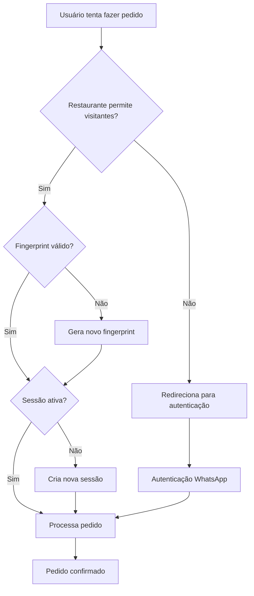
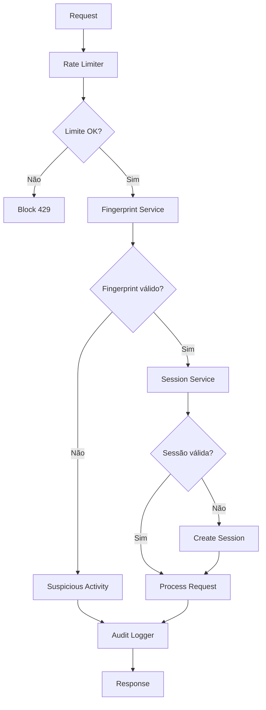

# Documento de Design - Sistema de Pedidos com Usuário Visitante

## Visão Geral

Este documento descreve o design técnico para implementar um sistema de autenticação segura baseado em QR Code + Fingerprint com fallback para Magic Links via WhatsApp, incluindo a funcionalidade configurável de pedidos com usuário visitante. O sistema prioriza segurança, facilidade de uso e conformidade com padrões da indústria.

O sistema atual é uma aplicação Next.js que utiliza Zustand para gerenciamento de estado. A arquitetura segue um padrão de design limpo com separação clara entre domínio, infraestrutura e componentes de UI.

## Arquitetura

### Arquitetura Atual

O sistema atual segue uma arquitetura em camadas:

1. **Camada de Apresentação**: Componentes React/Next.js (`/src/components`, `/src/app`)
2. **Camada de Infraestrutura**: Implementações concretas de repositórios e serviços (`/src/infrastructure`)
3. **Camada de Domínio**: Entidades, interfaces de repositório e casos de uso (`/src/domain`)
4. **Camada de Estado**: Gerenciamento de estado global com Zustand (`/src/store`)

### Modificações Propostas

Para implementar o sistema de autenticação segura, faremos as seguintes modificações na arquitetura:

1. **Serviço de Fingerprint**:
   - Implementar geração e validação de fingerprints de dispositivo
   - Criar sistema de detecção de mudanças suspeitas

2. **Sistema de Sessões Contextuais**:
   - Implementar sessões vinculadas a mesa/loja
   - Criar mecanismo de expiração automática

3. **Processamento de Acesso via QR Code**:
   - Processar parâmetros de URL do QR Code existente
   - Criar validação de contexto (mesa/loja) permitindo múltiplos usuários

4. **Magic Links WhatsApp**:
   - Implementar geração de JWT temporário
   - Criar sistema de validação e redirecionamento

5. **Cadastro de Usuário Visitante no Checkout**:
   - Implementar configuração por restaurante para cadastro rápido
   - Criar sistema de cadastro automático durante checkout

6. **Rate Limiting e Segurança**:
   - Implementar proteção contra abuso
   - Criar sistema de logs de auditoria

## Componentes e Interfaces

### 1. Serviço de Fingerprint

#### Interface do Serviço

```typescript
// Novo serviço em src/services/fingerprint.ts
export interface FingerprintService {
  generateFingerprint(): Promise<string>;
  validateFingerprint(fingerprint: string): boolean;
  getDeviceInfo(): DeviceInfo;
  detectSuspiciousChanges(oldFingerprint: string, newFingerprint: string): boolean;
}

export interface DeviceInfo {
  userAgent: string;
  screenResolution: string;
  timeZone: string;
  language: string;
  canvasHash: string;
  webglHash: string;
  deviceMemory?: number;
  hardwareConcurrency?: number;
}

export class BrowserFingerprintService implements FingerprintService {
  async generateFingerprint(): Promise<string> {
    const deviceInfo = this.getDeviceInfo();
    const canvas = await this.generateCanvasFingerprint();
    const webgl = await this.generateWebGLFingerprint();
    
    const fingerprint = {
      ...deviceInfo,
      canvasHash: canvas,
      webglHash: webgl
    };
    
    return this.hashFingerprint(fingerprint);
  }

  private async generateCanvasFingerprint(): Promise<string> {
    // Implementação de canvas fingerprinting
  }

  private async generateWebGLFingerprint(): Promise<string> {
    // Implementação de WebGL fingerprinting
  }

  private hashFingerprint(data: any): string {
    // Implementação de hash SHA-256
  }
}
```

### 2. Sistema de Sessões Contextuais

#### Interface de Sessão

```typescript
// Novo modelo em src/domain/entities/ContextualSession.ts
export interface ContextualSession {
  id: string;
  storeId: string;
  tableId?: string;
  isDelivery: boolean;
  fingerprint: string;
  ipAddress: string;
  userAgent: string;
  createdAt: Date;
  expiresAt: Date;
  lastActivity: Date;
  orderCount: number;
  totalSpent: number;
  isAuthenticated: boolean;
  customerId?: string;
}

// Serviço de sessão em src/services/sessionService.ts
export interface SessionService {
  createSession(context: SessionContext): Promise<ContextualSession>;
  validateSession(sessionId: string): Promise<boolean>;
  updateActivity(sessionId: string): Promise<void>;
  expireSession(sessionId: string): Promise<void>;
  getActiveSessions(storeId: string): Promise<ContextualSession[]>;
  cleanExpiredSessions(): Promise<void>;
}

export interface SessionContext {
  storeId: string;
  tableId?: string;
  isDelivery: boolean;
  fingerprint: string;
  ipAddress: string;
  userAgent: string;
  customerId?: string;
}
```

### 3. Hook de Autenticação

```typescript
// Hook principal em src/hooks/useAuth.ts
export interface AuthState {
  session: ContextualSession | null;
  isLoading: boolean;
  isAuthenticated: boolean;
  isGuest: boolean;
  canOrderAsGuest: boolean;
}

export interface AuthActions {
  initializeSession: (context: SessionContext) => Promise<void>;
  authenticateWithWhatsApp: (phone: string) => Promise<void>;
  verifyWhatsAppCode: (phone: string, code: string) => Promise<void>;
  logout: () => Promise<void>;
  checkGuestOrderPermission: () => boolean;
}

export const useAuth = (): AuthState & AuthActions => {
  const [state, setState] = useState<AuthState>({
    session: null,
    isLoading: true,
    isAuthenticated: false,
    isGuest: false,
    canOrderAsGuest: false
  });

  const initializeSession = async (context: SessionContext) => {
    // Implementação de inicialização de sessão
  };

  const authenticateWithWhatsApp = async (phone: string) => {
    // Implementação de autenticação WhatsApp
  };

  const checkGuestOrderPermission = () => {
    // Verifica se o restaurante permite pedidos de visitantes
    // e se o fingerprint é válido
  };

  return { ...state, initializeSession, authenticateWithWhatsApp, /* ... */ };
};
```

### 4. Processamento de Acesso via QR Code

```typescript
// Hook para processar acesso via QR Code em src/hooks/useQRCodeAccess.ts
export interface QRCodeAccessData {
  storeId: string;
  tableId?: string;
  isDelivery: boolean;
}

export interface TableStatus {
  id: string;
  isActive: boolean;
  isOccupied: boolean;
  currentSessions: number;
  maxSessions: number;
  storeStatus: 'open' | 'closed' | 'busy';
}

export const useQRCodeAccess = () => {
  const processQRCodeAccess = async (params: URLSearchParams): Promise<ContextualSession> => {
    const storeId = params.get('store');
    const tableId = params.get('table');
    const isDelivery = params.get('isDelivery') === 'true';
    
    if (!storeId) {
      throw new Error('Link inválido - loja não encontrada');
    }
    
    // Valida se a mesa existe e está disponível
    if (tableId) {
      const tableStatus = await validateTableAccess(storeId, tableId);
      if (!tableStatus.isActive) {
        throw new Error('Mesa não está disponível');
      }
      if (tableStatus.storeStatus === 'closed') {
        throw new Error('Restaurante está fechado');
      }
    }
    
    // Gera fingerprint do dispositivo
    const fingerprint = await fingerprintService.generateFingerprint();
    
    // Cria sessão contextual (permite múltiplas sessões por mesa)
    const session = await sessionService.createSession({
      storeId,
      tableId,
      isDelivery,
      fingerprint,
      ipAddress: await getClientIP(),
      userAgent: navigator.userAgent
    });
    
    return session;
  };

  const validateTableAccess = async (storeId: string, tableId: string): Promise<TableStatus> => {
    const response = await fetch(`/api/stores/${storeId}/tables/${tableId}/status`);
    if (!response.ok) {
      throw new Error('Erro ao validar mesa');
    }
    return response.json();
  };

  return { processQRCodeAccess };
};

// Componente para processar acesso em src/components/auth/QRCodeProcessor.tsx
export function QRCodeProcessor() {
  const { processQRCodeAccess } = useQRCodeAccess();
  const { initializeSession } = useAuth();
  const router = useRouter();
  
  useEffect(() => {
    const processAccess = async () => {
      try {
        const params = new URLSearchParams(window.location.search);
        const session = await processQRCodeAccess(params);
        await initializeSession(session);
        
        // Remove parâmetros da URL para segurança
        const cleanUrl = window.location.pathname;
        router.replace(cleanUrl);
      } catch (error) {
        // Redireciona para página de erro apropriada
        router.push('/error?type=invalid-access');
      }
    };
    
    processAccess();
  }, []);

  return <LoadingSpinner message="Processando acesso..." />;
}
```

### 5. Magic Links WhatsApp

```typescript
// Serviço em src/services/whatsappAuth.ts
export interface WhatsAppAuthService {
  requestMagicLink: (phone: string, storeId: string) => Promise<void>;
  validateMagicLink: (token: string) => Promise<ContextualSession>;
}

export class WhatsAppAuthServiceImpl implements WhatsAppAuthService {
  async requestMagicLink(phone: string, storeId: string): Promise<void> {
    const response = await fetch('/api/auth/whatsapp/request', {
      method: 'POST',
      headers: { 'Content-Type': 'application/json' },
      body: JSON.stringify({ phone, storeId })
    });
    
    if (!response.ok) {
      throw new Error('Falha ao solicitar link');
    }
  }

  async validateMagicLink(token: string): Promise<ContextualSession> {
    const response = await fetch('/api/auth/whatsapp/validate', {
      method: 'POST',
      headers: { 'Content-Type': 'application/json' },
      body: JSON.stringify({ token })
    });
    
    if (!response.ok) {
      throw new Error('Token inválido');
    }
    
    return response.json();
  }
}

// Componente em src/components/auth/WhatsAppAuth.tsx
export function WhatsAppAuth({ storeId, onSuccess }: WhatsAppAuthProps) {
  const [phone, setPhone] = useState('');
  const [isLoading, setIsLoading] = useState(false);
  
  const handleRequest = async () => {
    setIsLoading(true);
    try {
      await whatsappAuthService.requestMagicLink(phone, storeId);
      // Mostrar mensagem de sucesso
    } catch (error) {
      // Mostrar erro
    } finally {
      setIsLoading(false);
    }
  };

  return (
    <div className="whatsapp-auth">
      <input
        type="tel"
        value={phone}
        onChange={(e) => setPhone(e.target.value)}
        placeholder="Seu WhatsApp"
      />
      <button onClick={handleRequest} disabled={isLoading}>
        Receber Link
      </button>
    </div>
  );
}
```

### 6. Sistema de Cadastro de Usuário Visitante no Checkout

```typescript
// Modelo em src/domain/entities/StoreSettings.ts
export interface StoreSettings {
  id: string;
  storeId: string;
  allowQuickRegistration: boolean; // Permite cadastro rápido no checkout
  sessionDuration: {
    table: number; // em horas
    delivery: number; // em horas
  };
  rateLimiting: {
    qrCode: number; // tentativas por hora
    whatsapp: number; // tentativas por dia
    fingerprint: number; // validações por hora
  };
  security: {
    requireAuthForOrders: boolean;
    blockSuspiciousFingerprints: boolean;
    enableAuditLogs: boolean;
  };
}

// Interface para dados de cadastro rápido
export interface QuickRegistrationData {
  fullName: string;
  phone: string;
  email?: string;
}

// Serviço de cadastro rápido em src/services/quickRegistration.ts
export interface QuickRegistrationService {
  registerUser: (data: QuickRegistrationData, sessionId: string) => Promise<Customer>;
  validatePhone: (phone: string) => boolean;
  checkExistingUser: (phone: string) => Promise<Customer | null>;
}

export class QuickRegistrationServiceImpl implements QuickRegistrationService {
  async registerUser(data: QuickRegistrationData, sessionId: string): Promise<Customer> {
    // Verifica se usuário já existe
    const existingUser = await this.checkExistingUser(data.phone);
    if (existingUser) {
      // Atualiza sessão com usuário existente
      await sessionService.updateSessionWithCustomer(sessionId, existingUser.id);
      return existingUser;
    }

    // Cria novo usuário
    const response = await fetch('/api/customers/quick-register', {
      method: 'POST',
      headers: { 'Content-Type': 'application/json' },
      body: JSON.stringify({
        ...data,
        sessionId,
        registrationMethod: 'quick_checkout'
      })
    });

    if (!response.ok) {
      throw new Error('Falha ao cadastrar usuário');
    }

    const customer = await response.json();
    
    // Atualiza sessão com novo usuário
    await sessionService.updateSessionWithCustomer(sessionId, customer.id);
    
    return customer;
  }

  async checkExistingUser(phone: string): Promise<Customer | null> {
    const response = await fetch(`/api/customers/by-phone/${phone}`);
    if (response.status === 404) {
      return null;
    }
    if (!response.ok) {
      throw new Error('Erro ao verificar usuário');
    }
    return response.json();
  }

  validatePhone(phone: string): boolean {
    // Validação básica de telefone brasileiro
    const phoneRegex = /^\(\d{2}\)\s\d{4,5}-\d{4}$/;
    return phoneRegex.test(phone);
  }
}

// Componente de checkout com cadastro rápido
export function CheckoutWithQuickRegistration({ storeId }: CheckoutProps) {
  const { session, isAuthenticated } = useAuth();
  const { settings } = useStoreSettings(storeId);
  const [registrationData, setRegistrationData] = useState<QuickRegistrationData>({
    fullName: '',
    phone: '',
    email: ''
  });
  const [isRegistering, setIsRegistering] = useState(false);

  const handleQuickRegistration = async () => {
    if (!session) return;
    
    setIsRegistering(true);
    try {
      const quickRegService = new QuickRegistrationServiceImpl();
      const customer = await quickRegService.registerUser(registrationData, session.id);
      
      // Usuário agora está autenticado, pode prosseguir com o pedido
      // Atualizar estado de autenticação
      await authService.refreshSession();
      
    } catch (error) {
      // Mostrar erro
    } finally {
      setIsRegistering(false);
    }
  };

  // Se usuário não está autenticado e cadastro rápido está habilitado
  if (!isAuthenticated && settings?.allowQuickRegistration) {
    return (
      <div className="quick-registration">
        <h3>Finalize seu pedido</h3>
        <p>Para continuar, precisamos de algumas informações:</p>
        
        <form onSubmit={(e) => { e.preventDefault(); handleQuickRegistration(); }}>
          <input
            type="text"
            placeholder="Nome completo"
            value={registrationData.fullName}
            onChange={(e) => setRegistrationData(prev => ({ ...prev, fullName: e.target.value }))}
            required
          />
          
          <input
            type="tel"
            placeholder="WhatsApp (11) 99999-9999"
            value={registrationData.phone}
            onChange={(e) => setRegistrationData(prev => ({ ...prev, phone: e.target.value }))}
            required
          />
          
          <input
            type="email"
            placeholder="E-mail (opcional)"
            value={registrationData.email}
            onChange={(e) => setRegistrationData(prev => ({ ...prev, email: e.target.value }))}
          />
          
          <button type="submit" disabled={isRegistering}>
            {isRegistering ? 'Cadastrando...' : 'Continuar'}
          </button>
        </form>
        
        <div className="alternative-auth">
          <p>Já tem conta? <button onClick={() => {/* Abrir modal WhatsApp */}}>Entre com WhatsApp</button></p>
        </div>
      </div>
    );
  }

  // Se usuário não está autenticado e cadastro rápido está desabilitado
  if (!isAuthenticated && !settings?.allowQuickRegistration) {
    return <WhatsAppAuth storeId={storeId} onSuccess={() => {/* Refresh session */}} />;
  }

  // Usuário autenticado - mostrar checkout normal
  return <CheckoutForm />;
}

// Hook para configurações
export const useStoreSettings = (storeId: string) => {
  const [settings, setSettings] = useState<StoreSettings | null>(null);
  
  const updateQuickRegistrationSetting = async (allow: boolean) => {
    const response = await fetch(`/api/stores/${storeId}/settings`, {
      method: 'PATCH',
      headers: { 'Content-Type': 'application/json' },
      body: JSON.stringify({ allowQuickRegistration: allow })
    });
    
    if (response.ok) {
      setSettings(prev => prev ? { ...prev, allowQuickRegistration: allow } : null);
    }
  };

  return { settings, updateQuickRegistrationSetting };
};
```

### 7. Rate Limiting

```typescript
// Serviço em src/services/rateLimiter.ts
export interface RateLimiter {
  checkLimit: (key: string, limit: number, window: number) => Promise<boolean>;
  incrementCounter: (key: string, window: number) => Promise<void>;
  blockIP: (ip: string, duration: number) => Promise<void>;
  isBlocked: (ip: string) => Promise<boolean>;
}

export class RedisRateLimiter implements RateLimiter {
  async checkLimit(key: string, limit: number, window: number): Promise<boolean> {
    // Implementação com Redis ou localStorage para desenvolvimento
  }

  async incrementCounter(key: string, window: number): Promise<void> {
    // Implementação do contador
  }
}

// Middleware em src/middleware/rateLimiting.ts
export function withRateLimit(
  type: 'qrcode' | 'whatsapp' | 'fingerprint',
  limit: number,
  window: number
) {
  return async (req: NextRequest) => {
    const ip = req.ip || 'unknown';
    const key = `${type}:${ip}`;
    
    const rateLimiter = new RedisRateLimiter();
    const allowed = await rateLimiter.checkLimit(key, limit, window);
    
    if (!allowed) {
      return new Response('Rate limit exceeded', { status: 429 });
    }
    
    await rateLimiter.incrementCounter(key, window);
  };
}
```

### 8. Sistema de Logs de Auditoria

```typescript
// Serviço em src/services/auditLogger.ts
export interface AuditEvent {
  id: string;
  type: 'session_created' | 'session_expired' | 'suspicious_activity' | 'order_placed' | 'auth_attempt';
  storeId: string;
  sessionId?: string;
  fingerprint?: string;
  ipAddress: string;
  userAgent: string;
  metadata: Record<string, any>;
  timestamp: Date;
}

export interface AuditLogger {
  log: (event: Omit<AuditEvent, 'id' | 'timestamp'>) => Promise<void>;
  getEvents: (storeId: string, filters?: AuditFilters) => Promise<AuditEvent[]>;
  cleanOldEvents: (olderThan: Date) => Promise<void>;
}

export class DatabaseAuditLogger implements AuditLogger {
  async log(event: Omit<AuditEvent, 'id' | 'timestamp'>): Promise<void> {
    // Implementação de log no banco/localStorage
  }

  async getEvents(storeId: string, filters?: AuditFilters): Promise<AuditEvent[]> {
    // Implementação de busca de eventos
  }
}
```

## Modelos de Dados

### Modelo de Fingerprint

```typescript
// Modelo em src/domain/entities/DeviceFingerprint.ts
export interface DeviceFingerprint {
  hash: string;
  userAgent: string;
  screenResolution: string;
  timeZone: string;
  language: string;
  canvasHash: string;
  webglHash: string;
  deviceMemory?: number;
  hardwareConcurrency?: number;
  ipAddress: string;
  geolocation?: {
    latitude: number;
    longitude: number;
    accuracy: number;
  };
  createdAt: Date;
  lastSeen: Date;
  isBlocked: boolean;
  suspiciousActivity: number;
}
```

### Modelo de Pedido Estendido

```typescript
// Extensão em src/domain/entities/Order.ts
export interface Order {
  // Campos existentes...
  
  // Novos campos para autenticação
  sessionId: string;
  fingerprint: string;
  isGuestOrder: boolean;
  customerId?: string;
  authMethod: 'qrcode' | 'whatsapp' | 'guest';
  ipAddress: string;
  userAgent: string;
  createdAt: Date;
}
```

## Tratamento de Erros

### Erros de Fingerprint

- Implementar fallback quando fingerprint não pode ser gerado
- Tratar mudanças suspeitas com solicitação de reautenticação
- Implementar recuperação automática para fingerprints corrompidos

### Erros de Sessão

- Tratar expiração de sessão com redirecionamento apropriado
- Implementar recuperação de sessão quando possível
- Tratar conflitos de sessão entre dispositivos

### Erros de Rate Limiting

- Implementar mensagens claras sobre limites excedidos
- Fornecer informações sobre quando tentar novamente
- Implementar sistema de apelação para bloqueios incorretos

## Estratégia de Testes

### Testes Unitários

- Testar geração e validação de fingerprints
- Testar criação e expiração de sessões
- Testar rate limiting em diferentes cenários
- Testar logs de auditoria

### Testes de Integração

- Testar fluxo completo de QR Code
- Testar fluxo completo de Magic Link
- Testar pedidos com usuário visitante
- Testar configurações de administração

### Testes de Segurança

- Testar proteção contra ataques de força bruta
- Testar validação de contexto
- Testar detecção de atividade suspeita
- Testar conformidade com LGPD/GDPR

## Diagramas

### Fluxo de Autenticação QR Code



### Fluxo de Magic Link WhatsApp



### Fluxo de Pedido Visitante



### Arquitetura de Segurança



## Considerações de Implementação

### Performance

- Utilizar cache para fingerprints válidos
- Implementar lazy loading para componentes de autenticação
- Otimizar geração de fingerprint para não bloquear UI

### Segurança

- Implementar CSP (Content Security Policy) rigoroso
- Utilizar HTTPS obrigatório para todas as comunicações
- Implementar proteção contra CSRF em todas as APIs

### Escalabilidade

- Considerar uso de Redis para cache de sessões
- Implementar limpeza automática de dados antigos
- Otimizar queries de auditoria com índices apropriados

### Conformidade

- Implementar banner de consentimento claro
- Fornecer mecanismo de opt-out funcional
- Documentar todos os dados coletados e seu uso

### Monitoramento

- Implementar métricas de autenticação
- Monitorar tentativas de abuso
- Alertar sobre padrões suspeitos de acesso