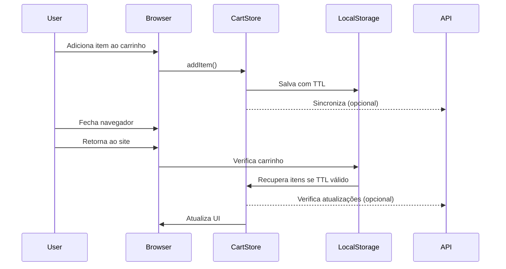
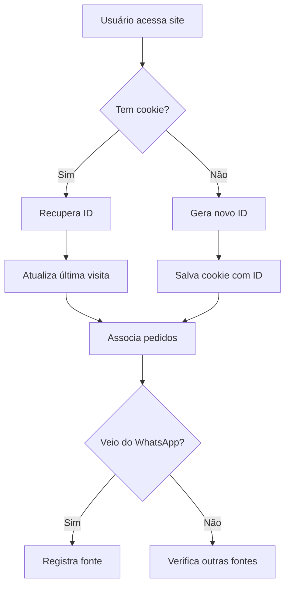
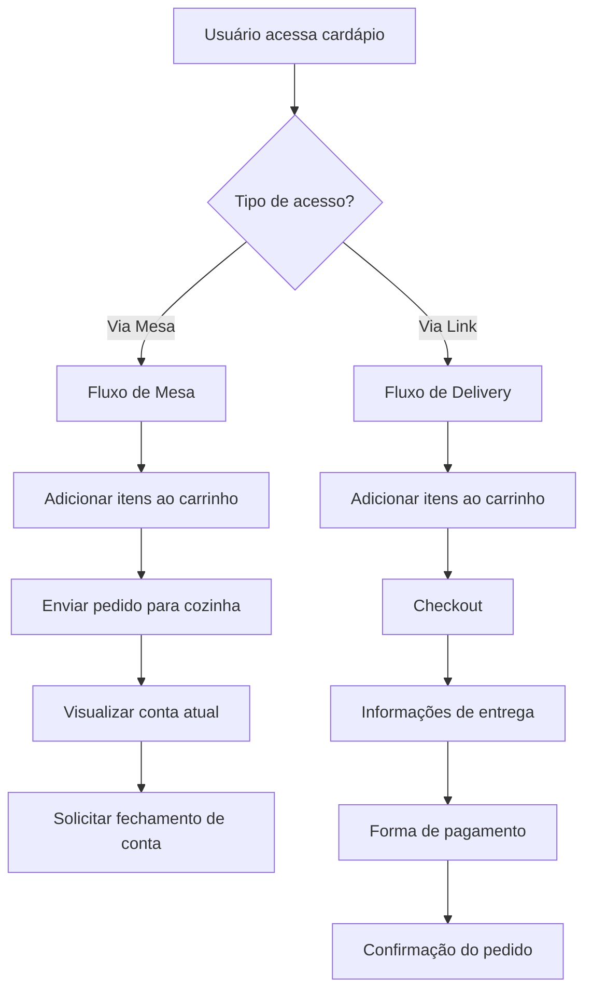
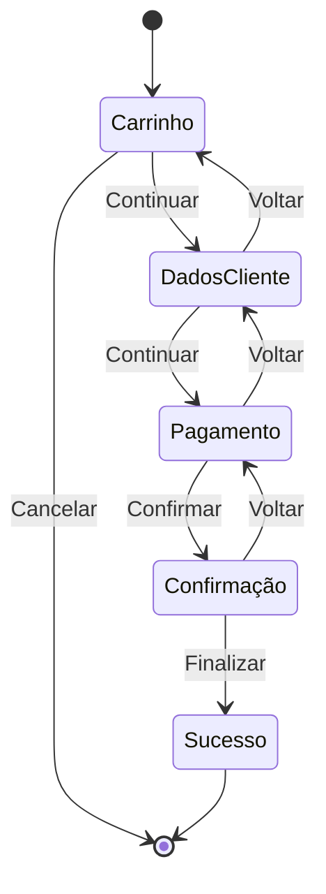
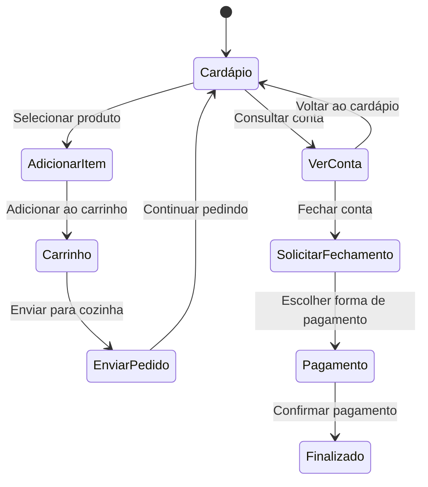

# Documento de Design: Melhorias no Menu

## Visão Geral

Este documento descreve o design técnico para implementar as melhorias necessárias no sistema de cardápio digital, conforme especificado nos requisitos. As melhorias incluem: persistência do carrinho, implementação de uma tela de checkout, rastreamento de usuários, suporte a múltiplos layouts e melhorias na interface do usuário.

O sistema atual é uma aplicação Next.js que utiliza Zustand para gerenciamento de estado, incluindo o carrinho de compras. A arquitetura segue um padrão de design limpo com separação clara entre domínio, infraestrutura e componentes de UI.

## Arquitetura

### Arquitetura Atual

O sistema atual segue uma arquitetura em camadas:

1. **Camada de Apresentação**: Componentes React/Next.js (`/src/components`, `/src/app`)
2. **Camada de Infraestrutura**: Implementações concretas de repositórios e serviços (`/src/infrastructure`)
3. **Camada de Domínio**: Entidades, interfaces de repositório e casos de uso (`/src/domain`)
4. **Camada de Estado**: Gerenciamento de estado global com Zustand (`/src/store`)

### Modificações Propostas

Para implementar as melhorias necessárias, faremos as seguintes modificações na arquitetura:

1. **Persistência Aprimorada do Carrinho**:
   - Modificar o store Zustand para garantir persistência consistente
   - Implementar mecanismo de sincronização entre dispositivos/sessões

2. **Tela de Checkout**:
   - Adicionar nova rota e componentes para o processo de checkout
   - Integrar com o sistema de carrinho existente

3. **Rastreamento de Usuário**:
   - Implementar serviço de rastreamento de usuário usando cookies
   - Criar repositório para armazenar e recuperar dados de usuário

4. **Suporte a Múltiplos Layouts**:
   - Criar sistema de temas/layouts configuráveis
   - Implementar componentes de layout alternativos

5. **Melhorias de UI**:
   - Redesenhar componentes específicos para melhor experiência do usuário
   - Otimizar exibição de logos e imagens

## Componentes e Interfaces

### 1. Persistência do Carrinho

#### Modificações no Store Zustand

```typescript
// Modificações em src/store/cart-store.ts
export const useCartStore = create<CartStore>()(
  persist(
    (set, get) => ({
      // Estado existente...
      
      // Novo método para sincronizar carrinho entre sessões
      syncCart: (storeId: string, deviceId: string) => {
        // Implementação para sincronizar carrinho
      },
      
      // Melhorar persistência com TTL (Time To Live)
      setCartTTL: (hours: number) => {
        // Implementação para definir TTL do carrinho
      }
    }),
    {
      name: 'digimenu-cart',
      // Configuração aprimorada de persistência
      storage: {
        getItem: (name) => {
          // Lógica para recuperar com verificação de TTL
          return localStorage.getItem(name);
        },
        setItem: (name, value) => {
          // Lógica para armazenar com TTL
          localStorage.setItem(name, value);
        },
        removeItem: (name) => localStorage.removeItem(name)
      }
    }
  )
);
```

#### Interface do Repositório de Carrinho

```typescript
// Modificações em src/domain/repositories/CartRepository.ts
export interface CartRepository {
  // Métodos existentes...
  
  // Novos métodos
  syncWithRemote(userId: string): Promise<void>;
  getCartWithTTL(): { items: CartItem[], expiresAt: Date };
  setCartTTL(hours: number): void;
}
```

### 2. Tela de Checkout e Fluxos de Pedido

#### Diferenciação de Fluxos

O sistema deve diferenciar dois fluxos principais de pedido:

1. **Fluxo de Mesa (Presencial)**:
   - Sem processo de checkout completo
   - Produtos são adicionados à conta da mesa
   - Interface para consultar conta atual
   - Botão para solicitar fechamento da conta
   - Pedidos são enviados diretamente para o backend

2. **Fluxo de Delivery (Online)**:
   - Processo de checkout completo
   - Captura de informações de entrega
   - Seleção de forma de pagamento
   - Confirmação do pedido

#### Componentes de Checkout (Fluxo Delivery)

Criaremos os seguintes componentes:

1. `CheckoutPage`: Página principal de checkout
2. `CheckoutSummary`: Resumo do pedido
3. `CheckoutForm`: Formulário para informações do cliente e endereço
   - Campos para nome, telefone, email
   - Campos para endereço completo (rua, número, complemento, bairro, cidade, CEP)
   - Opção para salvar endereço para pedidos futuros
4. `CheckoutPayment`: Opções de pagamento com checkboxes para seleção
   - Implementação inicial com checkboxes simples para cada método de pagamento
   - Métodos: Dinheiro, Cartão de Crédito, Cartão de Débito, PIX, Vale Refeição
   - Campo para troco (quando método "Dinheiro" for selecionado)
5. `CheckoutConfirmation`: Confirmação do pedido

#### Componentes de Conta (Fluxo Mesa)

Criaremos os seguintes componentes:

1. `TableBillPage`: Página para visualizar a conta da mesa
2. `TableBillSummary`: Resumo dos itens na conta
3. `TableBillActions`: Ações como solicitar garçom, pedir fechamento da conta
4. `TableBillConfirmation`: Confirmação de ações relacionadas à conta

#### Rotas

```typescript
// Rota de checkout para delivery
// src/app/[storeId]/checkout/page.tsx
export default function CheckoutPage() {
  // Implementação da página de checkout para delivery
}

// Rota de conta para mesa
// src/app/[storeId]/[tableId]/bill/page.tsx
export default function TableBillPage() {
  // Implementação da página de conta para mesa
}
```

#### Integração com Backend

O sistema verificará a disponibilidade dos seguintes endpoints:

1. `/api/orders` - Para envio de pedidos (delivery e mesa)
2. `/api/tables/{tableId}/bill` - Para consulta de conta da mesa
3. `/api/tables/{tableId}/close-bill` - Para fechamento de conta
4. `/api/customers` - Para cadastro/atualização de dados do cliente

Caso algum endpoint necessário não esteja disponível, será criado um documento de pendências para o backend.

### 3. Rastreamento de Usuário

#### Serviço de Rastreamento

```typescript
// Novo serviço em src/services/userTracking.ts
export interface UserTrackingService {
  trackUser(): string; // Retorna ID do usuário
  identifyUser(userId: string): void;
  trackSource(source: string): void;
  optOut(): void;
  isOptedOut(): boolean;
}

export class CookieUserTrackingService implements UserTrackingService {
  // Implementação usando cookies
}
```

#### Repositório de Usuário

```typescript
// Novo repositório em src/domain/repositories/UserRepository.ts
export interface UserRepository {
  getUserId(): string | null;
  setUserId(id: string): void;
  getUserPreferences(): UserPreferences;
  setUserPreferences(preferences: UserPreferences): void;
  getOrderHistory(): Order[];
}
```

### 4. Suporte a Múltiplos Layouts

#### Sistema de Temas/Layouts

```typescript
// Novo contexto em src/infrastructure/context/LayoutContext.tsx
export interface LayoutConfig {
  name: string;
  theme: {
    colors: {
      primary: string;
      secondary: string;
      // Outras cores...
    };
    spacing: {
      // Configurações de espaçamento...
    };
    // Outras configurações de tema...
  };
  components: {
    // Configurações específicas de componentes...
  };
}

export const LayoutContext = createContext<{
  layout: LayoutConfig;
  setLayout: (layout: LayoutConfig) => void;
}>({
  layout: defaultLayout,
  setLayout: () => {}
});
```

#### Componentes de Layout

Criaremos componentes de layout alternativos:

1. `DefaultLayout`: Layout padrão atual
2. `CompactLayout`: Layout compacto para menus menores
3. `FullWidthLayout`: Layout de largura total com imagens maiores
4. `GridLayout`: Layout em grade para categorias e produtos

### 5. Melhorias de UI

#### Botão "Fazer Pedido"

Redesenharemos o botão "Fazer Pedido" para ser menos intrusivo:

```tsx
// Componente melhorado em src/components/menu/OrderButton.tsx
export function OrderButton({ onClick, itemCount }: OrderButtonProps) {
  return (
    <button 
      onClick={onClick}
      className="fixed bottom-4 right-4 bg-primary text-white rounded-full p-3 shadow-lg flex items-center"
    >
      <ShoppingCartIcon className="h-6 w-6" />
      {itemCount > 0 && (
        <span className="ml-2 bg-white text-primary rounded-full h-5 w-5 flex items-center justify-center text-xs font-bold">
          {itemCount}
        </span>
      )}
    </button>
  );
}
```

#### Exibição de Logos

Melhoraremos a exibição de logos:

```tsx
// Componente melhorado em src/components/menu/StoreHeader.tsx
export function StoreHeader({ storeName, storeLogo }: StoreHeaderProps) {
  return (
    <div className="flex items-center">
      {storeLogo ? (
        <div className="relative h-16 w-16 overflow-hidden rounded-lg border-2 border-primary">
          <Image
            src={storeLogo}
            alt={storeName}
            fill
            style={{ objectFit: 'contain' }}
            sizes="64px"
            quality={90}
            priority
          />
        </div>
      ) : (
        // Fallback para quando não há logo
      )}
      <div className="ml-3">
        <h1 className="text-xl font-bold">{storeName}</h1>
        <p className="text-sm text-gray-500">Cardápio Digital</p>
      </div>
    </div>
  );
}
```

## Modelos de Dados

### Modelo de Usuário

```typescript
// Novo modelo em src/domain/entities/User.ts
export interface User {
  id: string;
  deviceId: string;
  source?: string;
  firstVisit: Date;
  lastVisit: Date;
  preferences: {
    theme?: string;
    language?: string;
    notifications?: boolean;
  };
  optOut: boolean;
}
```

### Modelo de Pedido Estendido

```typescript
// Modificações em src/domain/entities/Order.ts
export interface Order {
  // Campos existentes...
  
  // Novos campos
  userId?: string;
  deviceId?: string;
  source?: string;
  checkoutCompletedAt?: Date;
}
```

### Modelo de Layout

```typescript
// Novo modelo em src/domain/entities/Layout.ts
export interface Layout {
  id: string;
  name: string;
  description: string;
  config: {
    header: {
      style: string;
      position: string;
    };
    categories: {
      style: string;
      display: string;
    };
    products: {
      style: string;
      display: string;
    };
    cart: {
      style: string;
      position: string;
    };
    colors: {
      primary: string;
      secondary: string;
      accent: string;
      background: string;
      text: string;
    };
  };
}
```

## Tratamento de Erros

### Persistência do Carrinho

- Implementar mecanismo de fallback para quando o localStorage não estiver disponível
- Tratar erros de sincronização entre dispositivos
- Implementar recuperação automática em caso de dados corrompidos

### Rastreamento de Usuário

- Tratar cenários onde cookies são bloqueados
- Implementar mecanismo alternativo de identificação quando cookies não estiverem disponíveis
- Garantir conformidade com leis de privacidade (LGPD/GDPR)

## Estratégia de Testes

### Testes Unitários

- Testar persistência do carrinho em diferentes cenários
- Testar mecanismo de rastreamento de usuário
- Testar renderização de diferentes layouts

### Testes de Integração

- Testar fluxo completo de checkout
- Testar sincronização de carrinho entre sessões
- Testar adaptação de layouts em diferentes dispositivos

### Testes de UI

- Testar responsividade dos novos componentes
- Testar acessibilidade dos formulários de checkout
- Testar comportamento do botão de pedido em diferentes contextos

## Diagramas

### Fluxo de Persistência do Carrinho



### Arquitetura de Rastreamento de Usuário



### Diferenciação de Fluxos (Mesa vs Delivery)



### Fluxo de Checkout (Delivery)



### Fluxo de Mesa (Presencial)



## Considerações de Implementação

### Persistência do Carrinho

- Utilizar localStorage com TTL para persistência básica
- Considerar implementação de sincronização com backend para usuários identificados
- Implementar mecanismo de merge para resolver conflitos entre dispositivos

### Rastreamento de Usuário

- Utilizar cookies de primeira parte para rastreamento básico
- Implementar banner de consentimento para conformidade com LGPD/GDPR
- Armazenar dados mínimos necessários para funcionalidade

### Múltiplos Layouts

- Implementar sistema de temas baseado em contexto React
- Criar componentes que se adaptam ao tema atual
- Permitir override de estilos específicos por loja

### Melhorias de UI

- Seguir princípios de design responsivo
- Garantir acessibilidade em todos os componentes
- Otimizar carregamento de imagens e logos