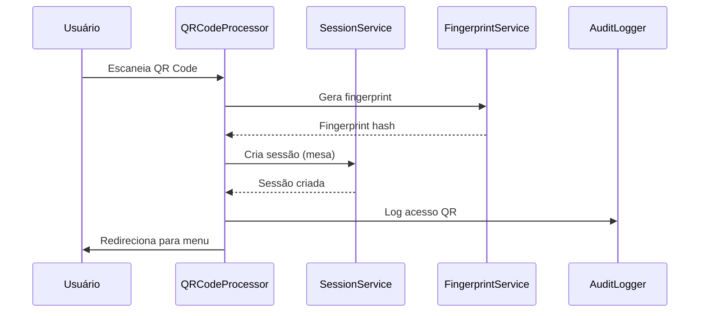
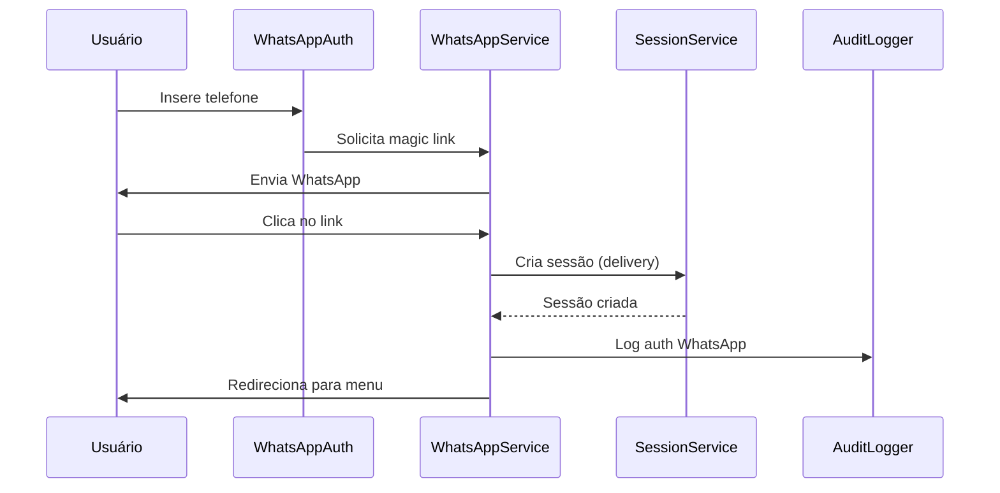
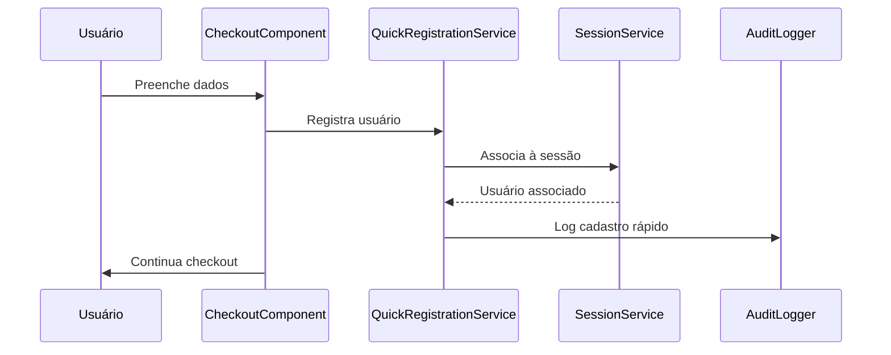

# Documentação Técnica - Sistema de Pedidos com Usuário Visitante

## Visão Geral

Este sistema permite que usuários façam pedidos sem necessidade de cadastro prévio, utilizando identificação por fingerprint de dispositivo e sessões contextuais. O sistema oferece múltiplas formas de autenticação e mantém alta segurança através de rate limiting e detecção de atividades suspeitas.

## Arquitetura do Sistema

### Componentes Principais

1. **Serviço de Fingerprint** (`src/services/fingerprint.ts`)
   - Gera identificação única do dispositivo
   - Utiliza canvas, WebGL, user agent e outras características
   - Implementa fallbacks para ambientes restritivos

2. **Sistema de Sessões** (`src/services/sessionService.ts`)
   - Gerencia sessões contextuais (mesa/delivery)
   - Controla expiração automática
   - Associa usuários às sessões

3. **Rate Limiting** (`src/services/rateLimiting.ts`)
   - Controla taxa de requisições por IP/fingerprint
   - Bloqueia IPs suspeitos automaticamente
   - Configurações específicas por tipo de operação

4. **Auditoria** (`src/services/auditLogger.ts`)
   - Registra todos os eventos importantes
   - Sincronização automática com backend
   - Consultas e estatísticas

5. **Privacidade** (`src/components/privacy/`)
   - Banner de consentimento LGPD-compliant
   - Controles granulares de privacidade
   - Sistema de opt-out completo

## APIs e Interfaces

### Serviço de Fingerprint

```typescript
interface FingerprintService {
  generateFingerprint(): Promise<FingerprintResult>
  validateFingerprint(hash: string): Promise<ValidationResult>
  compareFingerprints(hash1: string, hash2: string): Promise<ComparisonResult>
}

interface FingerprintResult {
  hash: string
  components: FingerprintComponents
  confidence: number
  timestamp: Date
}
```

### Sistema de Sessões

```typescript
interface SessionService {
  createSession(context: SessionContext): Promise<ContextualSession>
  validateSession(sessionId: string): Promise<SessionValidationResult>
  updateActivity(sessionId: string): Promise<void>
  associateCustomer(sessionId: string, customerId: string): Promise<void>
  expireSession(sessionId: string): Promise<void>
}

interface ContextualSession {
  id: string
  storeId: string
  fingerprint: string
  isAuthenticated: boolean
  customerId?: string
  context: SessionContext
  createdAt: Date
  lastActivity: Date
  expiresAt: Date
}
```

### Rate Limiting

```typescript
interface RateLimitingService {
  checkRateLimit(identifier: string, type: RateLimitType): Promise<RateLimitResult>
  recordAttempt(identifier: string, type: RateLimitType, success: boolean): Promise<void>
  blockIP(ip: string, type: RateLimitType, reason: string): Promise<void>
  unblockIP(ip: string): Promise<void>
}

type RateLimitType = 'qr_code' | 'whatsapp' | 'fingerprint' | 'general'
```

### Auditoria

```typescript
interface AuditLogger {
  logEvent(type: AuditEventType, description: string, details: any): Promise<void>
  queryEvents(query: AuditQuery): Promise<{ events: AuditEvent[], total: number }>
  getStatistics(days?: number): Promise<AuditStatistics>
}

type AuditEventType = 
  | 'session_created' | 'session_expired' | 'customer_associated'
  | 'whatsapp_auth_requested' | 'whatsapp_auth_validated'
  | 'quick_registration' | 'qr_code_access'
  | 'suspicious_activity_detected' | 'ip_blocked'
  | 'privacy_consent_given' | 'privacy_opt_out'
```

## Fluxos de Autenticação

### 1. Acesso via QR Code (Mesa)



### 2. Magic Link via WhatsApp (Delivery)



### 3. Cadastro Rápido no Checkout



## Configurações de Segurança

### Rate Limits Padrão

```typescript
const RATE_LIMITS = {
  qr_code: {
    windowMs: 60 * 60 * 1000, // 1 hora
    maxRequests: 10,
    blockDurationMs: 60 * 60 * 1000 // 1 hora
  },
  whatsapp: {
    windowMs: 24 * 60 * 60 * 1000, // 24 horas
    maxRequests: 3,
    blockDurationMs: 24 * 60 * 60 * 1000 // 24 horas
  },
  fingerprint: {
    windowMs: 60 * 60 * 1000, // 1 hora
    maxRequests: 100,
    blockDurationMs: 2 * 60 * 60 * 1000 // 2 horas
  }
}
```

### Detecção de Atividade Suspeita

O sistema detecta automaticamente:
- Requisições muito rápidas (>50 em 1 minuto)
- Múltiplos fingerprints do mesmo IP (>5 em 10 minutos)
- Comportamento de bot (intervalos regulares, user-agent suspeito)
- Múltiplas sessões simultâneas (>10 por IP)

### Políticas de Retenção

```typescript
const RETENTION_POLICIES = {
  sessions: '1 hora após expiração',
  fingerprints: '24 horas',
  auditLogs: '30 dias',
  rateLimitData: '7 dias',
  suspiciousActivities: '90 dias'
}
```

## Hooks Principais

### useAuth

Hook principal de autenticação que integra todos os sistemas:

```typescript
const {
  session,
  isLoading,
  isAuthenticated,
  isGuest,
  canOrderAsGuest,
  fingerprint,
  error,
  initializeSession,
  validateCurrentSession,
  logout,
  associateCustomer
} = useAuth()
```

### useQRCodeAccess

Processa acesso via QR Code:

```typescript
const {
  isProcessing,
  isSuccess,
  error,
  accessData,
  processQRCodeAccess,
  retryAccess
} = useQRCodeAccess()
```

### useStoreSettings

Gerencia configurações da loja:

```typescript
const {
  settings,
  isLoading,
  canOrderAsGuest,
  isQuickRegistrationEnabled,
  updateSettings
} = useStoreSettings(storeId)
```

### usePrivacyConsent

Gerencia consentimento de privacidade:

```typescript
const {
  consent,
  hasOptedOut,
  canUseFingerprinting,
  canUseAnalytics,
  updateConsent,
  revokeConsent
} = usePrivacyConsent()
```

## Componentes Principais

### ConsentBanner

Banner de consentimento LGPD-compliant:

```tsx
<ConsentBanner
  onConsentGiven={(consent) => console.log('Consent:', consent)}
  onOptOut={() => console.log('User opted out')}
/>
```

### QRCodeProcessor

Processamento automático de QR Code:

```tsx
<QRCodeProcessor
  onSuccess={() => console.log('QR processed')}
  onError={(error) => console.log('Error:', error)}
  autoRedirect={true}
/>
```

### WhatsAppAuth

Autenticação via WhatsApp:

```tsx
<WhatsAppAuth
  storeId="store_123"
  onSuccess={(sessionId) => console.log('Auth success')}
  onError={(error) => console.log('Auth error')}
/>
```

### CheckoutWithQuickRegistration

Checkout com cadastro rápido:

```tsx
<CheckoutWithQuickRegistration
  onSuccess={(customerId) => console.log('Registered:', customerId)}
  onError={(error) => console.log('Registration error')}
/>
```

## Middleware

### Rate Limiting Middleware

```typescript
// middleware.ts
import { createRouteBasedRateLimitMiddleware } from '@/middleware/rate-limit-middleware'

export const middleware = createRouteBasedRateLimitMiddleware()

export const config = {
  matcher: ['/api/:path*', '/qr/:path*', '/auth/:path*']
}
```

### Auth Middleware

```typescript
import { createAuthMiddleware } from '@/middleware/auth-middleware'

const authMiddleware = createAuthMiddleware({
  requireAuth: false,
  allowGuest: true,
  requireSession: true
})
```

## Armazenamento Local

### Estrutura de Dados

```typescript
// localStorage keys
'privacy_consent' // Consentimento de privacidade
'digimenu-cart' // Carrinho de compras
'session_[id]' // Sessões ativas
'fingerprint_[hash]' // Dados de fingerprint
'audit_logs' // Logs de auditoria
'rate_limit_attempts_[ip]_[type]' // Tentativas de rate limit
'blocked_ips' // IPs bloqueados
'suspicious_activities' // Atividades suspeitas
```

### Limpeza Automática

O sistema executa limpeza automática a cada hora:
- Remove sessões expiradas
- Limpa fingerprints antigos
- Remove logs de auditoria antigos
- Limpa dados de rate limiting expirados

## Monitoramento e Logs

### Eventos de Auditoria

Todos os eventos importantes são registrados:
- Criação/expiração de sessões
- Tentativas de autenticação
- Atividades suspeitas detectadas
- Mudanças de configuração
- Ações de privacidade (consentimento/opt-out)

### Dashboard de Monitoramento

Interface administrativa para visualizar:
- Sessões ativas em tempo real
- Logs de auditoria filtráveis
- Estatísticas de segurança
- Atividades suspeitas
- Relatórios de limpeza

## Conformidade com LGPD

### Dados Coletados

1. **Identificação do Dispositivo (Fingerprinting)**
   - Base legal: Interesse legítimo (segurança)
   - Retenção: 24 horas
   - Opt-out: Disponível

2. **Dados de Sessão**
   - Base legal: Execução contratual
   - Retenção: 4h mesa, 2h delivery + 1h
   - Opt-out: Não aplicável (essencial)

3. **Dados de Autenticação**
   - Base legal: Consentimento
   - Retenção: Até remoção da conta
   - Opt-out: Disponível

4. **Analytics e Marketing**
   - Base legal: Consentimento
   - Retenção: 30 dias (detalhado), 1 ano (agregado)
   - Opt-out: Disponível

### Direitos do Usuário

- ✅ Acesso aos dados coletados
- ✅ Correção de dados pessoais
- ✅ Portabilidade (exportação JSON)
- ✅ Esquecimento (opt-out completo)
- ✅ Transparência sobre uso dos dados

## Performance

### Benchmarks

- Geração de fingerprint: < 1 segundo
- Validação de sessão: < 100ms
- Rate limit check: < 50ms
- Consulta de auditoria: < 200ms

### Otimizações

- Cache de fingerprint para múltiplas chamadas
- Lazy loading de componentes pesados
- Debounce em operações de UI
- Batch de eventos de auditoria
- Limpeza automática em background

## Troubleshooting

### Problemas Comuns

1. **Fingerprint não gerado**
   - Verificar se canvas/WebGL estão disponíveis
   - Verificar se crypto.subtle está disponível
   - Usar fallbacks implementados

2. **Sessão expira rapidamente**
   - Verificar configurações de TTL
   - Verificar se updateActivity está sendo chamado
   - Verificar sincronização de relógio

3. **Rate limit muito restritivo**
   - Verificar configurações por tipo
   - Verificar se IP não está bloqueado
   - Verificar janela de tempo

4. **Dados não persistem**
   - Verificar se localStorage está disponível
   - Verificar quotas de armazenamento
   - Verificar se dados não estão sendo limpos

### Logs de Debug

```typescript
// Habilitar logs detalhados
localStorage.setItem('debug_fingerprint', 'true')
localStorage.setItem('debug_sessions', 'true')
localStorage.setItem('debug_rate_limit', 'true')
```

### Comandos de Diagnóstico

```javascript
// Console do navegador
window.debugInfo = {
  fingerprint: await fingerprintService.generateFingerprint(),
  sessions: await sessionService.getActiveSessions('store_id'),
  rateLimit: await rateLimitingService.getStatistics(),
  audit: await auditLogger.getStatistics()
}
```